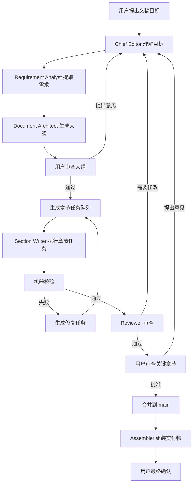
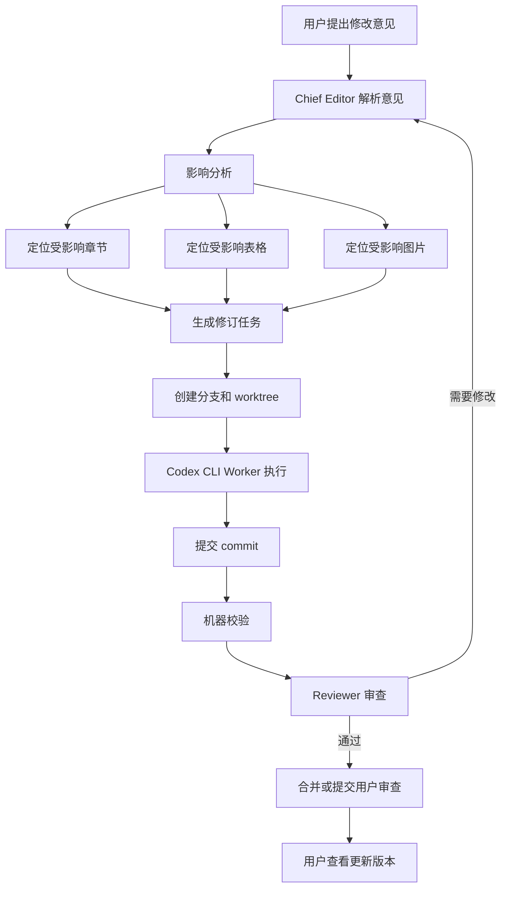
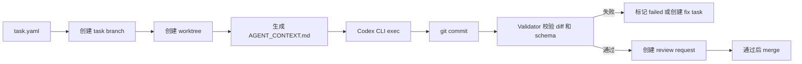

# Agentic 文稿撰写系统架构设计文档

版本：v0.1  
日期：2026-05-21  
定位：面向标书、技术规范书、申请书、方案书等长文稿的 Agentic 文稿工程系统

## 1. 背景与目标

本系统面向需要产出长篇、结构化、可审计文稿的场景，例如标书、技术规范书、项目申请书、建设方案、验收方案、白皮书等。这类文稿通常具备以下特征：

- 页数较多，最终可能达到数十页至数百页。
- 内容包含正文、表格、图片、图注、目录、引用、响应矩阵等多种元素。
- 文稿需要响应外部要求，例如招标文件、技术规范、评分办法、合同条款或专家意见。
- 写作过程需要多人协作、反复审稿、合并、修订和定稿。
- 最终结果不仅要“写得像”，还要满足结构、证据、风险、格式和审查要求。

系统设计的核心观点是：

> Agent 不直接“写一本书”，而是维护一份可审计、可迭代、可组装的文稿工程。

用户在系统中扮演类似“大老板”或最终负责人角色，主要负责提出目标、审查关键版本、提出修改意见和批准最终结果。Agent 系统负责拆解任务、生成内容、审查问题、落实修改、维护版本和组装交付物。

## 2. 第一性原理

长文稿写作的本质不是单纯生成文字，而是将一个目标转化成一份可被目标读者接受的交付物。这个过程至少包含以下能力：

1. 目标理解：理解文稿目的、读者、约束、交付格式和成功标准。
2. 需求响应：识别必须覆盖的条款、评分点、技术要求和风险点。
3. 结构设计：设计章节结构、逻辑顺序、篇幅分配和图表位置。
4. 内容生产：按章节、表格、图片 brief 等粒度生成内容。
5. 证据绑定：将正文陈述与来源资料、需求条款和企业知识关联。
6. 风险控制：避免无依据承诺、参数冲突、术语不一致和过度表达。
7. 审查修订：通过独立审查发现问题，并将意见转化为可执行任务。
8. 版本治理：记录每次修改的原因、范围、产物、审查结论和批准状态。
9. 组装交付：将已批准内容统一编号、排版并导出为目标格式。

因此，系统不应以“一次 LLM 调用生成全文”为中心，而应以“文稿工程对象、任务流、审查流、Git 协作流”为中心。

## 3. 设计原则

### 3.1 Git-native

所有实质性交互都应尽量在 Git 中完成：

- 每个 Agent 执行任务时创建独立分支。
- 每个任务通过 commit 留下可追踪产物。
- Reviewer 通过 review 文件、PR comment 或审查分支提出意见。
- 主干分支只保存已批准、可组装的文稿状态。
- 最终交付版本通过 release 分支或 tag 固化。

Git 是系统的协作总线，也是审计基础。

### 3.2 小任务、强边界

每个 Agent 不应自由修改整本文稿，而应处理一个小而明确的任务：

- 写某一小节。
- 补某个表格。
- 为某张图生成 brief。
- 审查某个 PR。
- 根据用户意见修订指定章节。

任务必须声明输入、输出、允许修改的文件和验收标准。

### 3.3 结构化交接

Agent 之间不依赖聊天式口头沟通，而是通过结构化文件交接：

- `task.yaml`
- `context/<task-id>-context-pack.md`
- `review.yaml`
- `section.meta.yaml`
- `image-brief.yaml`
- `run-manifest.yaml`

结构化交接能降低歧义，也方便机器校验和后续追踪。

### 3.4 人负责判断，Agent 负责生产

用户不应被卷入每个局部任务的执行细节。系统应将用户输入控制在关键决策点：

- 审大纲。
- 审样章。
- 审高风险章节。
- 提修改意见。
- 批准最终版本。

Chief Editor Agent 负责把用户的自然语言意见转译成具体任务。

### 3.5 不完全信任 Agent，自带校验

Agent 的边界约束不能只靠提示词，应通过 Git diff、schema 校验、状态机和审查流程共同约束。

例如，一个章节写作任务只允许修改：

```yaml
allowed_outputs:
  - manuscript/sections/03/02-system-architecture.md
  - manuscript/sections/03/02-system-architecture.meta.yaml
```

任务完成后，系统必须通过 `git diff --name-only base...HEAD` 检查是否越界修改。

## 4. 角色设计

系统中的角色不是简单照搬人类组织结构，而是从文稿生产功能拆分得到。推荐使用 6 个核心角色和 2 个可选角色。

### 4.1 用户 Sponsor

用户是最终负责人，类似“大老板”。

职责：

- 提出文稿目标和修改意见。
- 确认关键假设。
- 审查大纲、样章和最终版本。
- 对最终结果是否满意做判断。

用户不直接管理每个执行 Agent，而是主要与 Chief Editor 交互。

### 4.2 Chief Editor Agent

Chief Editor 是系统主编，类似“小老板”，也是最核心的 Agent。

职责：

- 理解用户目标和修改意见。
- 维护全局文稿状态。
- 生成任务拆解。
- 分配任务给不同执行角色。
- 汇总 Writer、Reviewer、Asset 等角色产物。
- 将用户意见转化为修订任务。
- 决定哪些内容需要重写、补证据、补图表或提交用户确认。

Chief Editor 需要读写较多全局文件，但应避免直接大段撰写正文。

### 4.3 Requirement Analyst Agent

Requirement Analyst 负责需求解析。

职责：

- 读取招标文件、技术要求、评分办法、规范标准。
- 提取需求条款、评分点、风险点和强制响应项。
- 生成需求响应矩阵。
- 标记缺失资料和高风险承诺。

主要产物：

- `knowledge/requirements.yaml`
- `knowledge/source-index.yaml`
- `plan/response-matrix.yaml`
- `knowledge/risk-rules.yaml`
- `runs/<task-id>/questions.yaml`

### 4.4 Document Architect Agent

Document Architect 负责文稿结构设计。

职责：

- 设计章节树。
- 分配章节目标、篇幅、图表需求和对应需求 ID。
- 明确章节之间的依赖关系和一致性约束。
- 生成章节任务模板。

主要产物：

- `plan/outline.yaml`
- `plan/section-tasks.yaml`
- `plan/document-blueprint.yaml`

### 4.5 Section Writer Agent

Section Writer 负责局部内容生产。

职责：

- 按任务包撰写指定章节或小节。
- 根据上下文包使用指定来源资料。
- 生成正文、局部表格草稿、段落级说明和章节元数据。
- 遇到缺资料时提出问题，不自行编造。

主要产物：

- `manuscript/sections/<section-id>.md`
- `manuscript/sections/<section-id>.meta.yaml`
- `runs/<task-id>/questions.yaml`
- `runs/<task-id>/evidence_requests.yaml`
- `runs/<task-id>/summary.md`

### 4.6 Reviewer Agent

Reviewer 负责独立审查，不负责直接润色正文。

职责：

- 审查 Writer 提交的 diff。
- 检查需求覆盖、逻辑一致性、风险承诺、术语统一、证据绑定和格式问题。
- 输出结构化审查结论。
- 对高风险问题标注严重级别。

主要产物：

- `reviews/<task-id>-review.yaml`
- PR review comments
- `reviews/<task-id>-summary.md`

Reviewer 原则上不直接修改正文。若需要自动修复，应由 Chief Editor 创建新的 revision 任务。

### 4.7 Asset Director Agent

Asset Director 是可选角色，负责图片和表格资产。

职责：

- 为正文中需要图片的位置生成 image brief。
- 生成图片模型 prompt。
- 生成图注和放置建议。
- 设计复杂表格 schema。
- 检查图文一致性。

主要产物：

- `assets/briefs/<asset-id>.yaml`
- `assets/prompts/<asset-id>.md`
- `assets/captions.yaml`
- `manuscript/tables/<table-id>.yaml`

### 4.8 Assembler Agent

Assembler 是可选角色，负责组装和导出。

职责：

- 只读取已批准内容。
- 统一章节编号、图表编号、引用、目录和交叉引用。
- 生成 Markdown、DOCX、PDF 或其他目标格式。
- 不修改正文语义。

主要产物：

- `assembly/manuscript.md`
- `assembly/manuscript.docx`
- `assembly/manuscript.pdf`
- `assembly/build-manifest.yaml`

## 5. 系统组件

### 5.1 Orchestrator

Orchestrator 是系统主控程序，不由 Codex CLI 自行承担。

职责：

- 创建项目仓库和目录结构。
- 创建任务包。
- 创建 Git branch 和 worktree。
- 组合全局、角色和任务级指令。
- 调用 Codex CLI 执行任务。
- 采集 stdout、stderr、commit、diff 和输出文件。
- 执行 schema 校验和越界修改检查。
- 根据结果推进状态机。

### 5.2 Codex CLI Worker

Codex CLI 是 Agent 执行单元。每个 worker 在一个隔离 worktree 中执行一个明确任务。

典型调用方式：

```bash
codex exec \
  --cd /path/to/worktrees/T-0032-section-writer \
  --sandbox workspace-write \
  --ask-for-approval never \
  "Follow AGENTS.md and runs/T-0032/AGENT_CONTEXT.md. Complete task T-0032 and commit your changes."
```

Codex CLI 不应直接拥有全局调度权，而应作为可替换、可审计的执行器。

### 5.3 Git Repository

Git 仓库保存所有文稿源文件、知识文件、任务文件、审查文件和组装产物。

推荐分支模型：

```text
main
  已批准、可组装的文稿状态

draft/*
  Chief Editor 的集成草稿分支

task/*
  Writer、Analyst、Architect 等角色的任务分支

review/*
  Reviewer 的审查分支

asset/*
  图片、表格等资产任务分支

release/*
  最终交付版本分支
```

### 5.4 Worktree Manager

Worktree Manager 负责为每个任务创建独立工作区。

示例：

```text
worktrees/
  T-0032-section-writer/
  T-0033-reviewer/
  T-0034-asset-director/
```

每个 worktree 对应一个 Git 分支，Agent 只在自己的 worktree 中工作。

### 5.5 Validator

Validator 负责机器校验。

校验内容：

- 输出文件是否存在。
- YAML/JSON 是否符合 schema。
- 是否越界修改文件。
- 是否遗漏任务声明的输出。
- 是否提交 commit。
- 正文章节长度是否在目标范围内。
- 需求 ID 是否存在于需求矩阵。
- 图片和表格编号是否唯一。

### 5.6 Review Interface

用户和 Agent 都通过 Git 进行交互。可以使用 GitHub/GitLab PR，也可以先用本地 Git + 文件化 review 实现。

用户主要看到：

- 大纲 PR。
- 样章 PR。
- 高风险章节 PR。
- 最终组装 PR。
- Chief Editor 汇总的修改说明。

## 6. 仓库结构设计

推荐目录结构：

```text
repo/
  AGENTS.md

  .agent/
    roles/
      chief-editor.md
      requirement-analyst.md
      document-architect.md
      section-writer.md
      reviewer.md
      asset-director.md
      assembler.md
    prompts/
      task-runner.md
      review-runner.md
    schemas/
      task.schema.json
      review.schema.json
      section-meta.schema.json
      image-brief.schema.json

  sources/
    raw/
      tender.pdf
      product_manual.docx
      company_profile.md
    excerpts/
      tender-chapter-3.md
      product-architecture.md

  knowledge/
    requirements.yaml
    response-matrix.yaml
    glossary.yaml
    style-guide.yaml
    risk-rules.yaml
    source-index.yaml

  plan/
    outline.yaml
    document-blueprint.yaml
    section-tasks.yaml

  tasks/
    T-0032-write-section-3-2.yaml

  context/
    T-0032-context-pack.md

  manuscript/
    sections/
      03/
        02-system-architecture.md
        02-system-architecture.meta.yaml
    tables/
    images/

  assets/
    briefs/
    prompts/
    generated/

  reviews/
    T-0032-review.yaml

  runs/
    T-0032/
      AGENT_CONTEXT.md
      stdout.log
      stderr.log
      manifest.yaml
      summary.md
      questions.yaml
      evidence_requests.yaml

  assembly/
    manuscript.md
    manuscript.docx
    manuscript.pdf
    build-manifest.yaml
```

## 7. 指令环境设计

### 7.1 分层 AGENTS 规则

系统不应为每个 Agent 动态改写根目录 `AGENTS.md`，否则容易污染正文分支。推荐使用四层指令：

1. 全局规则：`AGENTS.md`
2. 角色规则：`.agent/roles/<role>.md`
3. 任务规则：`tasks/<task-id>.yaml`
4. 上下文包：`context/<task-id>-context-pack.md`

Orchestrator 在运行任务前生成：

```text
runs/<task-id>/AGENT_CONTEXT.md
```

其中组合当前任务需要的角色、边界、输入、输出和验收标准。

### 7.2 三层信息环境

任务执行时的信息环境不应在“精心裁剪”和“全部资料开放”之间二选一。推荐使用三层信息环境：

```text
Layer 1: 必读证据包
  context/<task-id>-context-pack.md

Layer 2: 可检索资料索引与摘录
  knowledge/source-index.yaml
  sources/excerpts/

Layer 3: 原始资料仓库
  sources/raw/
```

`context/` 中的任务证据包是高质量起点，负责告诉执行 Agent 当前任务必须使用哪些需求、来源片段、用户决策、相邻章节摘要和风险约束。它不应包含整个资料库。

`knowledge/source-index.yaml` 和 `sources/excerpts/` 是受控自助检索层。执行 Agent 在证据包不足时，可以先查索引和摘录，补充必要证据，并在执行摘要中记录新增使用的 source ID。

`sources/raw/` 是原始资料仓库。通常只有 Requirement Analyst、Chief Editor 或被明确授权的检索任务可以读取。Section Writer 默认不直接读取原始资料；如果证据包和摘录层都不足，应写入 `runs/<task-id>/evidence_requests.yaml` 或 `questions.yaml`，由 Chief Editor 派发补证据任务。

Context pack 的主格式推荐使用 Markdown，并在文件顶部加入 YAML frontmatter。Markdown 便于 Agent 阅读，frontmatter 便于 Orchestrator 做基础校验和索引。

```markdown
---
task_id: T-0032
purpose: "撰写第 3.2 节系统总体架构"
must_use:
  - source_id: RQ-014
    summary: "系统可靠性要求"
search_hints:
  - "architecture"
known_gaps: []
forbidden_claims:
  - "不得承诺未被资料支持的可用性指标"
---

# Context Pack: T-0032

...
```

这个设计的原则是：

- 证据包负责可控、可审计和可复现。
- 检索层负责避免分发 Agent 漏选资料导致任务失败。
- 原始资料层负责保留完整事实来源，但不直接淹没局部写作任务。
- Reviewer 可以使用任务证据包和受控检索层抽查 Writer 是否被不完整上下文带偏。

任务包中的输入权限应显式区分：

```yaml
allowed_inputs:
  required:
    - AGENTS.md
    - .agent/roles/section-writer.md
    - context/T-0032-context-pack.md
    - knowledge/glossary.yaml
    - knowledge/style-guide.yaml
  searchable:
    - knowledge/source-index.yaml
    - sources/excerpts/
  restricted:
    - sources/raw/
```

### 7.3 全局 AGENTS.md 内容

全局规则应包含所有 Agent 的共同约束：

- 不得编造来源、参数或承诺。
- 不得修改任务范围外文件。
- 不得删除他人提交或重写历史。
- 所有实质产物必须落盘。
- 所有任务完成后必须提交 Git commit。
- 若信息不足，写入 `questions.yaml`。
- 若证据包不足，应先查任务允许的 searchable 输入；仍不足时写入 `evidence_requests.yaml` 或 `questions.yaml`。
- 不得读取 restricted 输入，除非任务明确授权。
- 正文主源使用 Markdown/YAML/JSON，不直接编辑最终 Word 交付物。
- 输出必须符合任务声明和 schema。

### 7.4 角色规则示例

Section Writer 的角色规则应强调：

- 只写指定章节。
- 必须覆盖任务中的需求 ID。
- 优先使用 context pack 中的必读证据。
- 证据不足时，只能在任务声明的 searchable 输入中检索补充资料。
- 不得修改大纲和其他章节。
- 遇到缺证据内容，应标记问题而不是自行补造。

Reviewer 的角色规则应强调：

- 只审查，不直接改正文。
- 优先指出高风险问题。
- 输出结构化 review。
- 每条问题必须包含文件、位置、严重级别、问题描述和建议。

## 8. 任务协议

### 8.1 Task YAML

每个任务都应有一个任务包。

示例：

```yaml
id: T-0032
type: section_write
role: section-writer
base_branch: main
branch: task/T-0032-write-section-3-2
worktree: worktrees/T-0032-section-writer

objective: >
  撰写第 3.2 节“系统总体架构”，突出可靠性、可扩展性和国产化适配能力。

allowed_inputs:
  required:
    - AGENTS.md
    - .agent/roles/section-writer.md
    - knowledge/glossary.yaml
    - knowledge/style-guide.yaml
    - knowledge/requirements.yaml
    - context/T-0032-context-pack.md
    - runs/T-0032/AGENT_CONTEXT.md
  searchable:
    - knowledge/source-index.yaml
    - sources/excerpts/
  restricted:
    - sources/raw/

allowed_outputs:
  - manuscript/sections/03/02-system-architecture.md
  - manuscript/sections/03/02-system-architecture.meta.yaml
  - runs/T-0032/questions.yaml
  - runs/T-0032/evidence_requests.yaml
  - runs/T-0032/summary.md

requirements:
  - RQ-014
  - RQ-017
  - RQ-021

constraints:
  - 不承诺未被资料支持的可用性指标。
  - 不引入未确认的第三方产品名称。
  - 如需说明性能指标，使用条件化表述。

acceptance_criteria:
  - 正文字数 1200 至 1800 字。
  - 明确响应所有 requirements 中列出的需求 ID。
  - section meta 中列出所依据的 source_refs。
  - 若使用 searchable 输入补充证据，summary 中记录新增 source ID。
  - 若证据仍不足，写入 evidence_requests.yaml，不自行编造。
  - 不修改 allowed_outputs 之外的文件。
```

### 8.2 Review YAML

Reviewer 输出示例：

```yaml
task_id: T-0032
reviewer_role: reviewer
verdict: needs_revision
summary: >
  章节整体结构完整，但存在一个高风险承诺和一个需求响应遗漏。

findings:
  - severity: high
    category: unsupported_claim
    file: manuscript/sections/03/02-system-architecture.md
    line: 42
    issue: "文中承诺 99.99% 可用性，但上下文资料中没有依据。"
    suggestion: "改为根据部署架构、冗余配置和运维条件确定可用性水平。"
    related_requirements:
      - RQ-014

  - severity: medium
    category: requirement_gap
    file: manuscript/sections/03/02-system-architecture.md
    issue: "未明确响应 RQ-017 中关于国产化适配的要求。"
    suggestion: "增加对操作系统、数据库、中间件和硬件平台适配策略的说明。"
    related_requirements:
      - RQ-017
```

### 8.3 Section Meta

章节元数据示例：

```yaml
section_id: "3.2"
title: "系统总体架构"
status: drafted
author_task: T-0032
covered_requirements:
  - RQ-014
  - RQ-017
  - RQ-021
source_refs:
  - source:tender.pdf#page=18
  - source:product_manual.docx#section=2.1
risk_notes:
  - "可用性指标使用条件化表述，未承诺固定数值。"
assets:
  tables: []
  images:
    - IMG-003
```

## 9. 状态机

文稿和任务都应有明确状态。

任务状态：

```text
planned
assigned
running
committed
machine_validated
review_requested
needs_revision
approved
merged
failed
```

章节状态：

```text
planned
drafting
drafted
machine_reviewed
human_review_required
approved
needs_revision
locked
assembled
```

只有 `approved` 或 `locked` 状态的章节可以进入最终组装。

## 10. 核心流程

### 10.1 新文稿任务流程



### 10.2 用户提出修改意见流程



### 10.3 Git-native 任务执行流程



## 11. 信息隔离设计

### 11.1 Worktree 隔离

每个任务使用独立 Git worktree：

```bash
git worktree add ../agent-worktrees/T-0032-section-writer -b task/T-0032-write-section-3-2 main
```

这样可以隔离文件修改、并行任务和失败回滚。

### 11.2 三层信息环境与上下文裁剪

Worktree 只能隔离修改，不能天然限制读取。真正的信息隔离应由 Orchestrator 通过三层信息环境实现：

```text
sources/raw/
  -> Requirement Analyst / Retriever
  -> sources/excerpts/ + knowledge/source-index.yaml
  -> Context Builder
  -> context/<task-id>-context-pack.md
  -> agent task
```

`context/` 是任务输入证据包，回答“这个任务当时基于哪些信息”。`runs/` 是执行记录，回答“这个任务当时如何执行”。两者应分离：

```text
context/
  T-0032-context-pack.md

runs/
  T-0032/
    AGENT_CONTEXT.md
    stdout.log
    stderr.log
    manifest.yaml
    summary.md
    questions.yaml
    evidence_requests.yaml
```

Context pack 应包含：

- `Must Use`：本任务必须使用的需求、来源片段、用户决策。
- `Helpful References`：可能有用但不强制使用的资料摘要。
- `Search Hints`：如果信息不足，优先检索的 source ID、关键词或摘录文件。
- `Known Gaps`：当前证据包中已知缺失的信息。
- `Forbidden Claims`：不得承诺的内容、不得写死的参数。
- `Adjacent Section Summaries`：相邻章节摘要，避免重复和冲突。

Context pack 不应包含：

- 全部原始 PDF 或 DOCX。
- 大段无关资料。
- 其他章节完整草稿。
- 运行日志、调试信息或 Agent 自我反思。

不同角色看到的信息范围不同：

```text
Chief Editor
  可读：全项目
  可写：tasks/, plan/, reviews/, integration branch

Requirement Analyst
  可读：sources/raw/, sources/excerpts/, knowledge/
  可写：knowledge/requirements.yaml, knowledge/source-index.yaml, plan/response-matrix.yaml, sources/excerpts/

Section Writer
  必读：task.yaml, context pack, glossary, style guide
  可检索：knowledge/source-index.yaml, sources/excerpts/
  默认不读：sources/raw/
  可写：指定章节、meta 文件、questions/evidence_requests/summary

Reviewer
  可读：目标 diff、需求矩阵、风险规则、context pack、source index、相关 excerpts
  可写：reviews/*.yaml 或 PR comments

Asset Director
  可读：章节草稿、图片需求、风格规范
  可写：assets/briefs/, assets/prompts/, captions

Assembler
  可读：approved manuscript
  可写：assembly/
```

### 11.3 越界修改检查

任务完成后，Validator 应执行：

```bash
git diff --name-only <base-branch>...HEAD
```

如果出现 `allowed_outputs` 之外的文件，应将任务标记为失败，或创建修复任务要求 Agent 回退越界改动。

## 12. 图片和表格处理

### 12.1 表格

表格不应由 LLM 直接以最终 Word 表格形式生成，而应先生成结构化数据：

```yaml
table_id: TBL-003
title: "系统关键能力响应表"
columns:
  - "需求编号"
  - "需求内容"
  - "响应方案"
  - "依据章节"
rows:
  - ["RQ-014", "系统可靠性要求", "采用分层冗余架构...", "3.2"]
```

之后由 Assembler 渲染为 Markdown、DOCX 或 PDF 表格。

### 12.2 图片

图片由图片生成模型生成，但不应直接让图像模型自由发挥。Asset Director 应先生成 image brief：

```yaml
id: IMG-003
task_id: T-0032
purpose: "生成系统总体架构示意图，支撑第 3.2 节总体架构说明。"
placement:
  section_id: "3.2"
  after_heading: "系统总体架构"
caption: "图 3-2 系统总体架构示意图"
required_elements:
  - 数据采集层
  - 平台服务层
  - 业务应用层
  - 运维管理模块
forbidden_elements:
  - 未确认的厂商 Logo
  - 未确认的产品名称
style: "正式技术规范书风格；清晰分层；中文标签。"
source_refs:
  - SRC-ARCH-001
```

用户可以先审 brief，再触发图片生成。

## 13. 审查策略

Reviewer 应优先检查以下问题：

- 是否遗漏需求条款。
- 是否出现无依据承诺。
- 是否前后术语不一致。
- 是否参数、单位、数字冲突。
- 是否使用未确认产品或技术路线。
- 是否存在空话、套话、无法验证的表述。
- 图表是否真实支撑正文。
- 章节是否超出任务范围。

审查结论分为：

```text
approved
needs_revision
blocked
human_decision_required
```

其中 `human_decision_required` 用于需要用户判断的情况，例如是否承诺某个指标、是否采用某个技术路线。

## 14. 用户交互模型

用户主要与 Chief Editor 交互。

用户可以输入：

- “帮我写一份某项目技术规范书。”
- “第 3 章太虚，补技术细节。”
- “国产化适配部分加强。”
- “表格里的参数不要承诺过死。”
- “整体语气更像正式投标文件。”

Chief Editor 负责将意见转化为任务：

- 定位受影响章节。
- 生成 revision task。
- 指派 Section Writer 或 Asset Director。
- 请求 Reviewer 检查修订结果。
- 合并通过的修改。
- 向用户汇报修改落实情况。

用户不需要直接管理每个 Agent 的分支，但可以通过 PR 查看具体 diff。

## 15. MVP 范围

第一版建议实现最小闭环，而不是直接支持数百页全文自动化。

MVP 功能：

1. 创建一个 Git 文稿项目。
2. 支持上传或放入资料文件。
3. 生成需求矩阵。
4. 生成文稿大纲。
5. 生成 3 个章节草稿。
6. 每个章节任务使用独立 branch 和 worktree。
7. Reviewer 输出结构化 review。
8. 用户提出修改意见后，Chief Editor 生成 revision task。
9. 只合并通过审查的内容。
10. 组装为 Markdown 或 DOCX。

MVP 角色：

- Chief Editor
- Requirement Analyst
- Section Writer
- Reviewer

Asset Director 和 Assembler 可先作为工具能力，后续再独立成角色。

## 16. 后续演进

后续可以逐步增强：

- 支持 GitHub/GitLab PR review API。
- 支持图像生成模型自动产图。
- 支持 DOCX 模板渲染。
- 支持需求覆盖率仪表盘。
- 支持多 Reviewer 交叉审查。
- 支持章节级质量评分。
- 支持历史项目知识复用。
- 支持企业术语库和禁用表述库。
- 支持 release 分支自动生成最终交付包。
- 支持用户在 Web UI 中以“大老板视角”审阅任务和版本。

## 17. 关键风险与对策

### 17.1 Agent 越界修改

风险：Agent 修改任务范围之外的文件。  
对策：任务声明 `allowed_outputs`，提交后用 Git diff 校验。

### 17.2 内容编造

风险：Agent 生成无来源的参数、产品能力或承诺。  
对策：要求 source refs；Reviewer 专门检查无依据承诺；缺资料写入 `questions.yaml`。

### 17.3 长文稿一致性崩坏

风险：不同章节风格、术语、参数不一致。  
对策：维护 `glossary.yaml`、`style-guide.yaml`、`risk-rules.yaml`；设置 Consistency Reviewer。

### 17.4 用户被 PR 淹没

风险：所有任务都要求用户审查，用户负担过重。  
对策：分级审查。普通章节 Reviewer 通过后可进入待合并，高风险章节和最终版本必须用户批准。

### 17.5 Word/PDF diff 不友好

风险：最终文档格式不适合作为主源。  
对策：以 Markdown/YAML/JSON 作为主源，DOCX/PDF 作为构建产物。

## 18. 总结

本系统的核心不是让一个 Agent 一次性生成一本书，而是建立一个以 Git 为协作总线、以 Codex CLI 为任务执行单元、以结构化任务和审查文件为交接协议的文稿工程系统。

理想使用体验是：

1. 用户提出目标。
2. Chief Editor 拆解并规划。
3. 多个 Codex CLI worker 在独立 worktree 中执行任务。
4. Reviewer 通过 Git 提出审查意见。
5. Chief Editor 将用户意见和 review 结果转化为新任务。
6. 只有通过审查和批准的内容进入主干。
7. Assembler 从主干组装最终交付文档。

最终结果不仅是一份文稿，也是一套完整的生成、审查、修改和批准记录。
